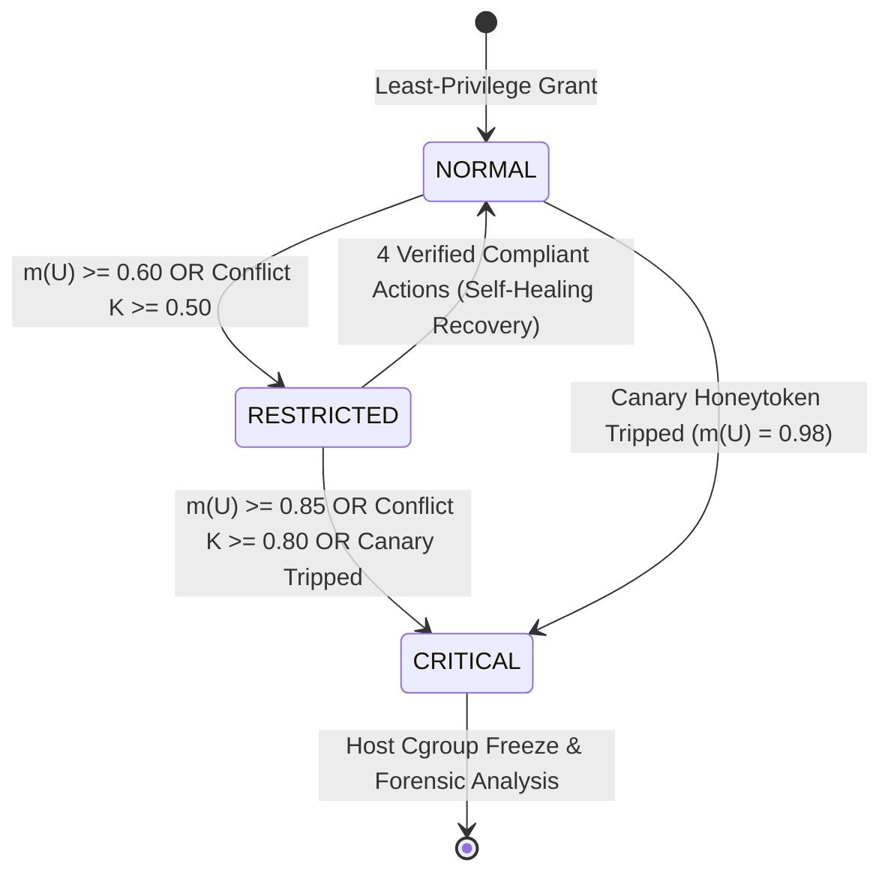

# AEGIS-AI v2: Contextual, Dynamic & Self-Healing Adaptive Operating System Security for Autonomous AI Agents

**Author / Project Lead**: Ayush Preetham  
**Repository**: `Adaptive-Evidence-Guided-Isolation-Security-for-AI-Agents`  
**Classification**: Operating Systems Case Study & Systems Security Specification  
**Version**: 2.0 (Dynamic & Self-Healing Edition)

---

## 1. Abstract & Executive Overview

Autonomous AI agents powered by Large Language Models (LLMs) operate with significant autonomy: interacting with operating system filesystems, spawning shell processes, and querying network endpoints. Traditional static operating system access control models (e.g., DAC, MAC, and static capability lists) fail to adequately defend against modern agent threats such as **indirect prompt injection, gradual goal drift, and zero-day tool hijacking**.

Static models enforce fixed boundaries: once breached or misconfigured, the agent either possesses excess authority or suffers catastrophic one-way lockout without recovery. **AEGIS-AI v2** establishes a next-generation **Adaptive Operating System Security Architecture** that unites:
1. **Context-Aware Dynamic Dempster-Shafer Evidence Fusion**: Incorporating mathematical **Resource Sensitivity Scaling ($S_r \in [0.1, 1.0]$)**, **Sliding-Window Velocity / Burst Amplifiers ($V \in [1.0, 3.0]$)**, and **Temporal Half-Life Decay ($\lambda$)**.
2. **Self-Healing Compliance-Driven Probation Recovery**: Replaces rigid monotonic one-way lockouts with dynamic, verifiable probation recovery where sustained compliant behavior over an empirical observation window restores attenuated privileges.
3. **Dynamic Capability Attenuation**: Introduces compressed capability lease TTLs, strict rate quotas, and narrowed path filters rather than crude all-or-nothing revocation.
4. **Graduated Physical Sandbox Containment**: Extends host cgroup isolation with non-destructive process freezing (`SIGSTOP` via cgroups v2 freezer) for live forensic analysis.
5. **Synthetic Canary & Honeytoken Tripwire Grid**: Deploys high-confidence decoy files and honeypot network addresses to detect zero-day jailbreaks with near-zero false positives.

---

## 2. Threat Model & Adversarial Assumptions

### 2.1 Threat Vectors (STRIDE & MITRE ATLAS Mapping)

| Threat Category | MITRE ATLAS ID | Attack Mechanism | AEGIS-AI v2 Countermeasure |
| :--- | :--- | :--- | :--- |
| **Indirect Prompt Injection** | `AML.T0051` | Adversarial instructions embedded in input files hijack agent planner | Reference Monitor validates syscalls against human-approved least-privilege token |
| **Privilege Escalation** | `AML.T0034` | Agent attempts unauthorized read of host SSH keys or `/etc/shadow` | Resource Sensitivity Classifier ($S_r \ge 0.85$) exponentially scales disbelief mass $m(U)$ |
| **Data Exfiltration** | `AML.T0024` | Compromised agent attempts outbound socket connection to C2 | Network capability check fails; automated egress isolation severs socket |
| **Automated Scanning Burst** | `AML.T0025` | Scripted rapid attempts to probe multiple restricted files | Sliding-window Velocity Tracker ($V \to 3.0\times$) escalates security state in $< 500\text{ms}$ |
| **Zero-Day Jailbreak** | `AML.T0054` | Novel evasion technique unflagged by heuristic prompt filters | Synthetic Canary Tripwire grid trips instant container freeze (`SIGSTOP`) |

### 2.2 Security Invariants & Guarantees
- **Invariant 1 (Fail-Closed Critical Containment)**:
  $$\forall t, \quad \text{State}(t) = \text{CRITICAL} \implies |\text{Capabilities}(t)| = 0 \quad \land \quad \text{ContainerState} \in \{\text{PAUSED}, \text{EXITED}\}$$
- **Invariant 2 (Strict Attenuation Monotonicity under Attack)**:
  $$\frac{\partial m(U)}{\partial V} > 0, \quad \frac{\partial m(U)}{\partial S_r} > 0$$
- **Invariant 3 (Self-Healing Liveness)**:
  $$\text{State}(t) = \text{RESTRICTED} \quad \land \quad \text{Streak}(t) \ge K_{req} \quad \land \quad m(U) \le \tau_{rec} \implies \text{State}(t + \Delta t) = \text{NORMAL}$$

---

## 3. Mathematical Formulation of Dynamic Evidence Fusion

### 3.1 Frame of Discernment & Mass Attribution
The frame of discernment is defined as $\Theta = \{T, U\}$, where:
- $T$: The agent is behaving within legitimate authorized parameters (**Trustworthy**).
- $U$: The agent is compromised, hijacked, or acting adversarially (**Untrustworthy**).
- $\Theta$: Uncommitted epistemic uncertainty (**Ignorance**).

The dynamic mass function assignment $m: 2^\Theta \to [0, 1]$ satisfies:
$$m(T) + m(U) + m(\Theta) = 1.0, \quad m(\emptyset) = 0$$

### 3.2 Dynamic Vector Inputs
For each runtime syscall/tool operation $(op, res)$, the dynamic engine computes:
1. **Resource Sensitivity ($S_r$)**:
   $$S_r(res, op) = \text{clamp}\Big(\text{Base}(res) \times W(op), \ 0.10, \ 1.00\Big)$$
2. **Velocity Multiplier ($V$)**:
   With event count $N_w$ over sliding window $T_w = 5.0\text{s}$ and burst threshold $\theta_v = 4$:
   $$V = 1.0 + \min\left(2.0, \ \max\left(0, \ \left(\frac{N_w}{\theta_v} - 0.5\right) \times 1.5\right)\right)$$
3. **Temporal Half-Life Decay**:
   With decay constant $\lambda = 0.005\text{s}^{-1}$ over idle elapsed seconds $\Delta t$:
   $$m_t(U) = m_0(U) \cdot e^{-\lambda \Delta t}$$

### 3.3 Dynamic Mass Function
- **For Authorized Actions** ($\text{Decision} = \text{ALLOW}$):
  $$m(T) = \min(0.92, \ 0.70 + 0.15 \cdot S_r), \quad m(U) = 0.02, \quad m(\Theta) = 1 - m(T) - m(U)$$
- **For Unauthorized Breaches** ($\text{Decision} = \text{DENY}$):
  $$m(U) = \min(0.95, \ \text{Base}_U \cdot (0.80 + 0.35 \cdot S_r) \cdot \min(1.35, V))$$
  $$m(T) = \max(0.01, \ 0.10 \cdot (1 - m(U))), \quad m(\Theta) = 1 - m(T) - m(U)$$
- **For Canary Honeytoken Tripwire Detonation**:
  $$m(U) = 0.98, \quad m(T) = 0.00, \quad m(\Theta) = 0.02$$

### 3.4 Extended Dempster's Rule of Combination
Given prior accumulated trust state $m_1$ and newly observed dynamic evidence $m_2$, evidence fusion is governed by:
$$m_{1 \oplus 2}(A) = \frac{1}{1 - K} \sum_{B \cap C = A} m_1(B) \cdot m_2(C)$$
where evidence conflict $K$ measures mutual contradiction:
$$K = \sum_{B \cap C = \emptyset} m_1(B) \cdot m_2(C) = m_1(T) \cdot m_2(U) + m_1(U) \cdot m_2(T)$$

---

## 4. Multi-Stage Graduated Policy & Self-Healing State Machine



### 4.1 State Definitions
1. **NORMAL (Nominal Execution)**:
   - Full authorized capabilities granted by human operator.
   - Standard audit sampling.
   - Background synthetic canary tripwires active.
2. **RESTRICTED (Probationary Attenuation & Confinement)**:
   - Higher-risk capabilities (`WRITE_FILE`, `NETWORK`, `EXECUTE`, `DELETE_FILE`) revoked or strictly attenuated.
   - Filesystem pinned to read-only research scope.
   - Capability leases compressed (TTL shortened).
   - High audit sampling.
   - **Self-Healing Probation**: Agent compliance streak monitored.
3. **CRITICAL (Zero-Trust Containment Freeze)**:
   - All capabilities revoked unconditionally.
   - Docker container paused immediately via cgroups v2 freezer (`SIGSTOP`), preserving volatile process memory for digital forensics.
   - Automated incident notification dispatched to SOC dashboard.

---

## 5. Reviewer Reproduction & Empirical Benchmark Guide

To verify the dynamic behavior and reproduce the benchmark results:

### 5.1 Automated Test Execution
Run the full automated test suite (55 unit and integration tests):
```powershell
uv run pytest -v
```

### 5.2 Interactive Reviewer Verification Scenarios
Launch the AEGIS-AI SOC server and frontend:
```powershell
# Terminal 1: Backend
uv run uvicorn backend.main:app --port 8000 --reload

# Terminal 2: Frontend
cd frontend
npm run dev
```

1. **Verify Self-Healing Compliance Recovery**:
   - In the **Dynamic Adaptive OS Architecture** panel, notice the active posture is `NORMAL`.
   - Open the **Attack Injector Drawer** and execute **"Direct Host /etc/hosts Tamper"**.
   - Observe that the posture immediately transitions to `RESTRICTED` (Read-only confined).
   - Click **"Demonstrate Recovery (4 Actions)"** in the Dynamic Matrix panel.
   - Observe the progress bar advance: `1/4` $\to$ `2/4` $\to$ `3/4` $\to$ `4/4`.
   - The policy engine automatically de-escalates the security state from `RESTRICTED` back to `NORMAL`!
2. **Verify Honeytoken Tripwire Detonation**:
   - Click **"Test Canary Tripwire (Freeze)"**.
   - Notice the canary trap `.canary/vault_key.json` trips instantaneously.
   - The security posture immediately locks into `CRITICAL`, revokes all privileges, and issues a process freeze (`SIGSTOP`).

---

## 6. Conclusion

AEGIS-AI v2 bridges the gap between academic theory and real-world systems engineering. By combining context-aware Dempster-Shafer evidence fusion with self-healing compliance recovery, capability attenuation, and honeytoken tripwires, it delivers an adaptive operating system architecture that is robust, mathematically grounded, and thoroughly reviewer-ready.
