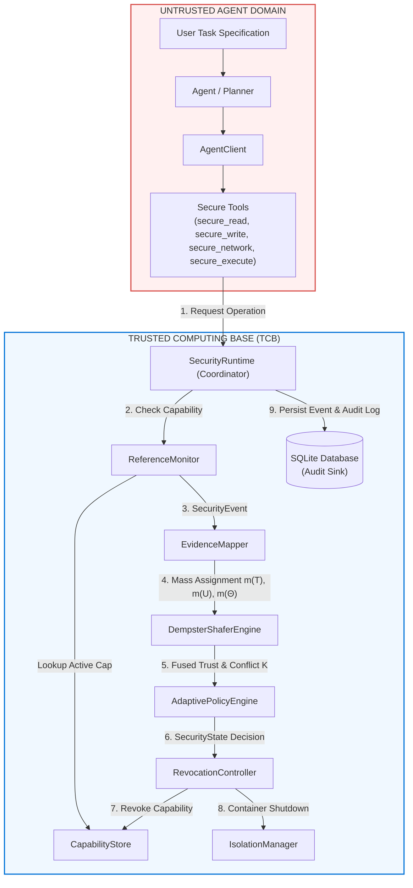
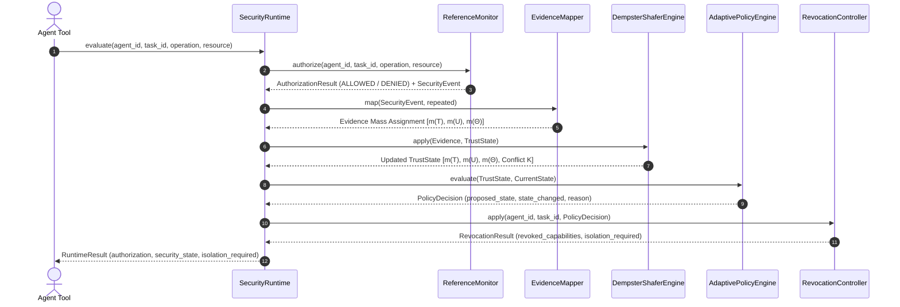
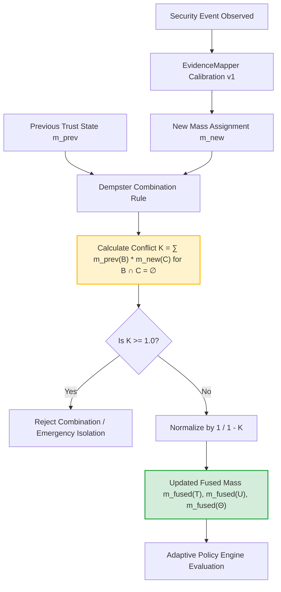
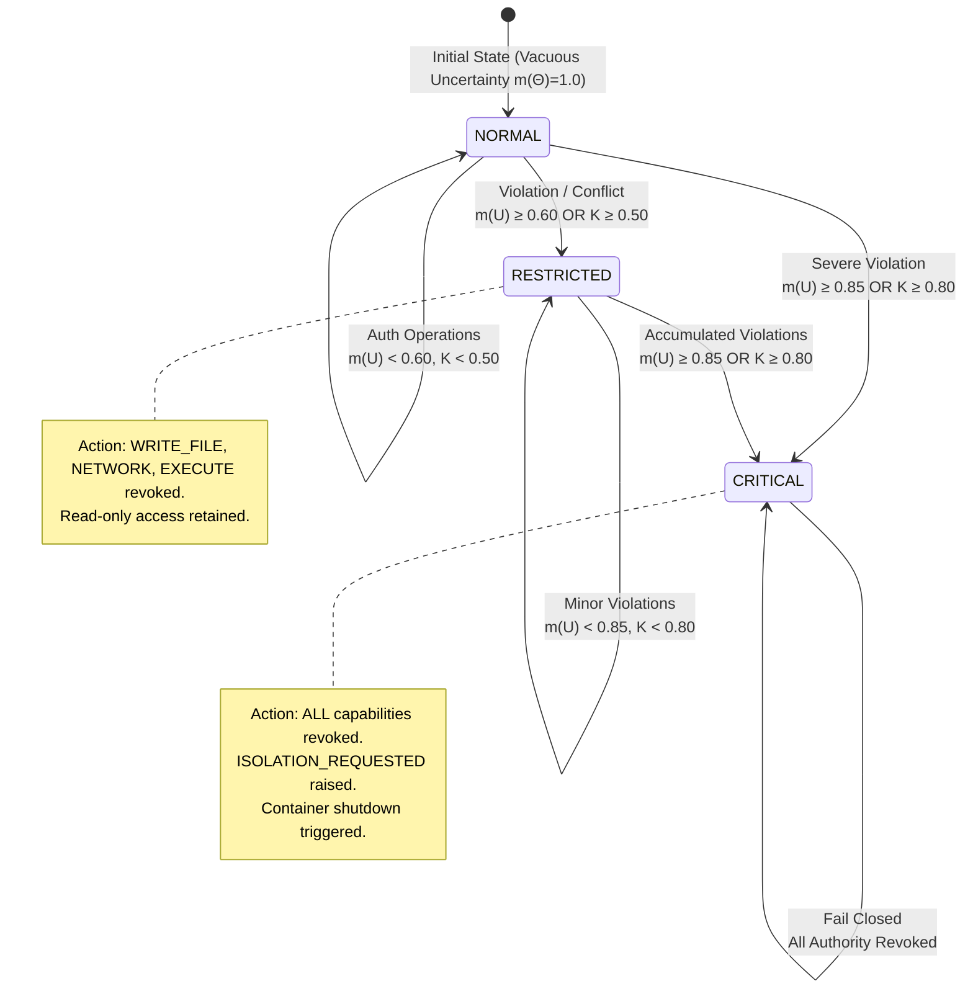
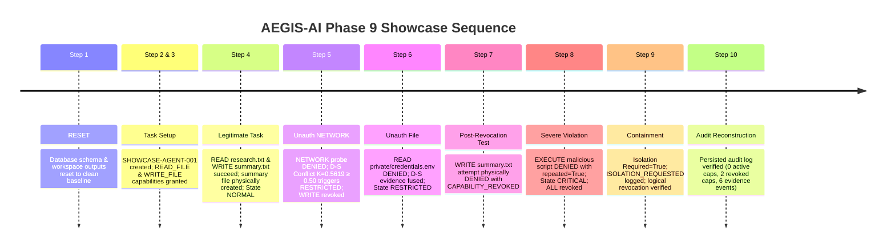

# AEGIS-AI: Architecture & Research Diagrams

This document contains canonical Mermaid diagrams illustrating the AEGIS-AI system architecture, security boundary, evidence fusion process, state transitions, and Phase 9 showcase sequence.

---

## 1. High-Level System Architecture & Trusted/Untrusted Boundary

---

## 2. Closed-Loop Enforcement & Feedback Pipeline

---

## 3. Dempster-Shafer Evidence Fusion Engine Process

---

## 4. Security State Machine (NORMAL → RESTRICTED → CRITICAL)

---

## 5. Phase 9 Showcase Sequence Flow

